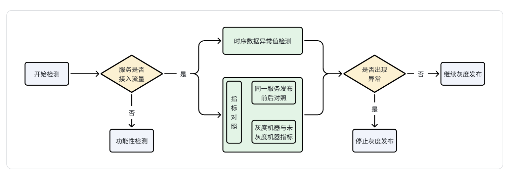

# 检测内容设计

## 总体方案
本项目构建了一套覆盖灰度发布全流程的智能检测方案，由三个核心模块组成：
首先，时序异常检测通过"分解+聚合"策略，将异常点转化为高可信事件，显著降低误报。其次，指标对照模块运用统计检验与效应分析，科学识别版本变更带来的真实影响，支撑发布决策。同时，功能检测模块主动验证数据链路与基础服务健康度，确保检测流程本身可靠。

## 检测流程图

## 设计目标
时序检测板块
- 降低误报率：通过分层过滤机制，将原始异常点转化为具有明确上下文的事件，减少无效告警。
- 提升可解释性：每一条告警附带异常分数、密度、持续时间等多维信息，便于定位根因。
- 支持灵活配置：提供阈值、周期、合并窗口等参数配置，适应不同业务场景。
指标对照板块
- 准确识别统计显著差异：通过严格的统计假设检验，准确判断两组数据是否存在显著差异。
- 提供可解释的差异分析：提供如 Cohen's d、相对差异等指标，帮助业务方理解差异的实际意义
- 支持多场景灵活配置：提供自定义置信水平、效应量阈值、检验方法等参数，适应不同场景
功能检测板块
- 保障基础服务可用性：在灰度发布前和发布过程中，主动检测关键基础服务的可用性，确保数据流畅通，避免因基础服务异常导致检测失效。

# 能力一：时序异常检测
旨在构建一个面向运维场景的高效时序异常检测系统，通过分层处理策略显著降低误报率，提升告警质量。系统采用两层检测结构：第一层基于STL分解进行初步异常检测，第二层通过智能规则对异常点进行过滤、聚合与分级，最终输出高可信度的结构化告警事件，帮助运维团队快速定位并处理真实异常。

## 方案优化方向
在完成基于传统统计方法的时序异常检测系统V1基础上，我们与团队就检测算法的未来发展路径进行了深入探讨：在LangGraph框架下裸调大模型效果也很好，在LLM效果也很好的情况下，是否还需要传统的检测算法呢？结合当前大语言模型（LLM）在异常检测领域展现的潜力，提出以下优化方向：

## 技术路径
目前我们面临三种可选的技术路径：
1. 纯传统算法路径：基于STL分解+规则过滤的成熟方案
2. 纯LLM路径：直接利用大模型的序列理解能力进行端到端检测
3. 混合智能路径：传统算法与LLM协同工作的融合方案

## 协同架构设计
经过各方讨论，我们更倾向于使用传统算法综合LLM的路径的设计思路：
阶段一：传统算法高效检测（触发阶段）
- 角色定位：作为第一道防线，负责高效、可靠地识别潜在异常
- 执行内容：
  1.使用STL分解等技术进行时序数据分解
  2.基于统计规则进行异常点检测和初步过滤
  3.生成结构化异常事件和关键指标
阶段二：LLM深度分析（解析阶段）
- 角色定位：作为智能分析层，提供深层次洞察和可操作性建议
- 输入内容：原始数据+时序检测算法输出结果
- 执行内容：
  1.接收传统算法输出的结构化告警指标以及原始数据
  2.进一步检测时序数据中的异常范围以及异常模式
  3.生成自然语言描述的告警内容和处理建议

## 开启流程
1. 输入数据
确保输入数据为CSV格式，包含三列：Series, Time, Value。示例：

| Series | Time | Value |
|--------|------|-------|
| yzh mirror | 2025-07-14T00:00:00+08:00 | 2392.4649649735443 |
| yzh mirror | 2025-07-14T00:10:00+08:00 | 1499.0522545027752 |
| yzh mirror | 2025-07-14T00:20:00+08:00 | 1916.094303250783 |
| yzh mirror | 2025-07-14T00:30:00+08:00 | 1208.302658310115 |
| yzh mirror | 2025-07-14T00:40:00+08:00 | 2536.5687803548194 |
2. 第一层检测
执行STL分解与异常检测：
python3 stl_anomaly_detection.py
输出文件：stl_anomaly_results.csv，包含分解结果与异常等级。

| Time | Value | trend | seasonal | residual | anomaly_score | anomaly_level |
|------|-------|-------|----------|----------|---------------|---------------|
| 2025-07-14 00:00:00+08:00 | 2392.4649649735443 | 2262.368522760809 | -435.86964873819244 | 565.966090950928 | 0.30989871493960036 | normal |
| 2025-07-14 00:10:00+08:00 | 1499.0522545027752 | 2259.9572942855593 | -928.4723997260509 | 167.56735994326664 | 0.03003302354684861 | normal |
| 2025-07-14 00:20:00+08:00 | 1916.094303250783 | 2257.552765623712 | -469.2043670147958 | 127.74590464186713 | 0.00205939247627821 | normal |

3. 第二层过滤
执行智能事件聚合与分级：
python3 second_layer_filter.py
输出文件：
- second_layer_events.csv：事件明细

| start_time | end_time | anomaly_count | anomaly_density | max_score | mean_score | severity_level |
|------------|----------|---------------|-----------------|-----------|------------|----------------|
| 2025-07-14 16:30:00+08:00 | 2025-07-14 16:30:00+08:00 | 1 | 1.0 | 22.91802223930438 | 22.91802223930438 | severe |
| 2025-07-15 15:30:00+08:00 | 2025-07-15 15:30:00+08:00 | 1 | 1.0 | 4.162401458789488 | 4.162401458789488 | severe |
| 2025-07-17 04:10:00+08:00 | 2025-07-17 04:50:00+08:00 | 3 | 1.0 | 2.560940053673524 | 2.194557674917012 | moderate |
| 2025-07-20 03:40:00+08:00 | 2025-07-20 04:10:00+08:00 | 2 | 1.0 | 4.587376198923394 | 3.3056069281056093 | severe |
- alert_messages.json：告警消息
[
  {
    "title": "[严重] 指标异常事件",
    "date": "2025-07-14",
    "time_window": "16:30",
    "stats": "异常点: 1个, 密度: 100.0%, 最高分: 22.92",
    "sample_points": [
      {
        "time": "16:30",
        "value": "34109",
        "score": "22.92"
      }
    ],
    "hint": "孤立尖峰异常",
    "severity_level": "severe",
    "max_score": 22.91802223930438
  },
  {
    "title": "[严重] 指标异常事件",
    "date": "2025-07-15",
    "time_window": "15:30",
    "stats": "异常点: 1个, 密度: 100.0%, 最高分: 4.16",
    "sample_points": [
      {
        "time": "15:30",
        "value": "9240",
        "score": "4.16"
      }
    ],
    "hint": "孤立尖峰异常",
    "severity_level": "severe",
    "max_score": 4.162401458789488
  },
  {
    "title": "[中等] 指标异常事件",
    "date": "2025-07-17",
    "time_window": "04:10 - 04:50",
    "stats": "异常点: 3个, 密度: 100.0%, 最高分: 2.56",
    "sample_points": [
      {
        "time": "04:50",
        "value": "5658",
        "score": "2.56"
      },
      {
        "time": "04:20",
        "value": "953",
        "score": "2.00"
      }
    ],
    "hint": "持续性异常波动",
    "severity_level": "moderate",
    "max_score": 2.560940053673524
  },
  {
    "title": "[严重] 指标异常事件",
    "date": "2025-07-20",
    "time_window": "03:40 - 04:10",
    "stats": "异常点: 2个, 密度: 100.0%, 最高分: 4.59",
    "sample_points": [
      {
        "time": "04:10",
        "value": "9595",
        "score": "4.59"
      },
      {
        "time": "03:40",
        "value": "883",
        "score": "2.02"
      }
    ],
    "hint": "持续性异常波动",
    "severity_level": "severe",
    "max_score": 4.587376198923394
  },
  {
    "title": "[严重] 指标异常事件",
    "date": "2025-07-20",
    "time_window": "05:00 - 06:00",
    "stats": "异常点: 5个, 密度: 100.0%, 最高分: 4.00",
    "sample_points": [
      {
        "time": "05:00",
        "value": "8756",
        "score": "4.00"
      },
      {
        "time": "05:30",
        "value": "5124",
        "score": "2.92"
      }
    ],
    "hint": "持续性异常波动",
    "severity_level": "severe",
    "max_score": 3.998751350467234
  }
]

    
## 设计细节
STL异常检测
检测原理:
- 使用STL（Seasonal and Trend decomposition using Loess）分解时序数据
- 将时间序列分解为：趋势(Trend) + 季节性(Seasonal) + 残差(Residual)
- 基于残差的Z-Score进行异常检测
异常分级:
- 轻微异常: 95%分位数 (|z-score| > 1.96)
- 明显异常: 98%分位数 (|z-score| > 2.33)  
- 严重异常: 99.5%分位数 (|z-score| > 2.81)
智能过滤与事件聚合
过滤流程:
步骤1: 粗筛过滤
  - 保留severe和moderate异常
  - 保留mild异常但分数≥2.0的点
  - 过滤掉：971个数据点 → 38个异常点
步骤2: 事件合并
  - 30分钟内相邻异常点合并为一个事件窗口
  - 计算事件统计信息：异常数量、密度、最高分、平均分
  - 合并结果：30个异常事件
步骤3: 事件分级
  严重事件条件（满足任一）:
  - max_score ≥ 3.0，或
  - 异常密度 ≥ 10% 且 异常数量 ≥ 5
  中等事件条件（满足任一）:
  - 2.0 ≤ max_score < 3.0，或  
  - 异常密度 ≥ 5% 且 异常数量 ≥ 3
  尖峰去噪:
  - 1-2个异常点的事件需要分数≥4.0才保留
步骤4: 去重限流
  - 60分钟内相似事件去重
  - 每日最多5个事件
  - 按严重程度和分数排序
配置参数
第一层配置
seasonal_period = 144      # 季节性周期（24小时）
threshold_percentiles = [95, 98, 99.5]  # 异常阈值
  第二层配置
max_gap_minutes = 30       # 事件合并间隔
severe_thresholds = {
    'max_score': 3.0,      # 严重异常分数阈值
    'density': 0.1,        # 异常密度阈值（10%）
    'min_count': 5         # 最小异常数量
}
spike_threshold = 4.0      # 尖峰保留阈值
max_daily_events = 5       # 每日最大事件数
  
# 能力二：指标对照
将这些对照检测视为统计假设检验问题。我们的原假设 (H0) 是："两组数据没有显著差异"。检测算法的作用就是在给定的置信水平下，判断是否有足够的证据拒绝原假设，从而认定差异是显著的。在进行检验的时候，除了看P值，还应该看效应大小，可以使用Cohen's d或者相对差异。只有当p值显著且效应大小超过某个业务阈值时，才触发告警。

## 对于同一服务发布前后对照 (Before/After)
比较服务在发布前（旧版本）和发布后（新版本）的同一指标是否存在显著差异，本质上就是两个独立样本的比较。可以使用的算法有T检验，Mann-Whitney U检验、K-S检验。
数据输入格式
[{"timestamp": "2025-08-29T14:00:00Z",
    "value": 150,
    "group": "before"
    },
    {"timestamp": "2025-08-29T14:01:00Z",
    "value": 152,
    "group": "before"
    },
    {"timestamp": "2025-08-29T14:02:00Z",
    "value": 148,
    "group": "before"
    }
]
数据输出格式
#输出T检验的统计检验结果
{"statistical_results": {
    "t_statistic": 0.781,
    "p_value": 0.434, 
    "degrees_of_freedom": 7198.12,
    "confidence_interval_95": [-8.12, 19.12] 
  },
 #效应大小-衡量差异的实际大小
    "effect_size": {
    "cohens_d": 0.02,
    "interpretation": "negligible effect size",
    "relative_change": -0.0052 }
 }

## 对于灰度机器与未灰度机器对比 (A/B)
比较在同一时间段内，运行新版本的灰度机器（实验组）和运行旧版本的未灰度机器（对照组）的同一指标是否存在显著差异。同样是两个独立样本的比较，但时间窗口是完全一致的，更能排除时间因素的干扰。可以使用的算法有T检验，Mann-Whitney U检验、K-S检验。
数据输入格式：
{
  "analysis_id": "canary_cpu_analysis_202508291400",
  "metric": "cpu_usage_percent", // 监控的指标名称
  "service": "example-service", // 服务名称
  "time_window": {
    "start": "2025-08-29T14:00:00Z",
    "end": "2025-08-29T14:10:00Z"
  }, // 监控的时间窗口，所有数据都来自此窗口
  "data_points": [
    // 实验组 (Canary Group) - 运行新版本的3台机器
    {
      "machine_id": "canary-host-1",
      "group": "canary",
      "value": 68.5
    },
    {
      "machine_id": "canary-host-2",
      "group": "canary",
      "value": 72.1
    },
    {
      "machine_id": "canary-host-3",
      "group": "canary",
      "value": 65.8
    },
    // 对照组 (Baseline Group) - 运行旧版本的7台机器
    {
      "machine_id": "baseline-host-1",
      "group": "baseline",
      "value": 59.8
    },
    {
      "machine_id": "baseline-host-2",
      "group": "baseline",
      "value": 61.2
    },
    {
      "machine_id": "baseline-host-3",
      "group": "baseline",
      "value": 60.5
    },
    {
      "machine_id": "baseline-host-4",
      "group": "baseline",
      "value": 58.9
    },
    {
      "machine_id": "baseline-host-5",
      "group": "baseline",
      "value": 62.0
    },
    {
      "machine_id": "baseline-host-6",
      "group": "baseline",
      "value": 61.7
    },
    {
      "machine_id": "baseline-host-7",
      "group": "baseline",
      "value": 60.3
    }
  ]
}

用更直观数据格式展示
timestamp,metric_name,service,host,group,value
2025-08-29T14:10:00Z,cpu_usage_percent,example-service,canary-host-1,canary,68.5
2025-08-29T14:10:00Z,cpu_usage_percent,example-service,canary-host-2,canary,72.1
2025-08-29T14:10:00Z,cpu_usage_percent,example-service,canary-host-3,canary,65.8
2025-08-29T14:10:00Z,cpu_usage_percent,example-service,baseline-host-1,baseline,59.8
2025-08-29T14:10:00Z,cpu_usage_percent,example-service,baseline-host-2,baseline,61.2
2025-08-29T14:10:00Z,cpu_usage_percent,example-service,baseline-host-3,baseline,60.5
2025-08-29T14:10:00Z,cpu_usage_percent,example-service,baseline-host-4,baseline,58.9
2025-08-29T14:10:00Z,cpu_usage_percent,example-service,baseline-host-5,baseline,62.0
2025-08-29T14:10:00Z,cpu_usage_percent,example-service,baseline-host-6,baseline,61.7
2025-08-29T14:10:00Z,cpu_usage_percent,example-service,baseline-host-7,baseline,60.3
2025-08-29T14:10:00Z,cpu_usage_percent,example-service,baseline-host-8,baseline,59.5
2025-08-29T14:10:00Z,cpu_usage_percent,example-service,baseline-host-9,baseline,61.0
2025-08-29T14:10:00Z,cpu_usage_percent,example-service,baseline-host-10,baseline,60.8
数据输出格式
#统计检验结果
{"statistical_test": {
    "name": "Welch's t-test",
    "result": {
    "t_statistic": 6.427, 
    "p_value": 0.00038,   
    "degrees_of_freedom": 2.71 }},
#效应大小
"effect_size": {
    "cohens_d": 3.47, 
    "interpretation": "huge effect size",
    "mean_difference": 8.16, 
    "relative_difference": 0.1345 
    }
  }

# 能力三：功能检测
在当前变更场景的灰度发布流程中，时序异常检测以及指标的核心逻辑依赖基础服务的稳定运行 —— 如果上传服务等关键基础服务异常，会直接导致后续检测 "无数据可处理" 或 "处理错误数据"，进而影响灰度发布的结果判断。
因此，新增功能检测模块，核心目标是在灰度发布启动前、发布过程中，前置验证基础服务的可用性与数据交互正确性，避免因基础服务问题干扰核心检测逻辑，保障灰度发布的平稳推进。例如：重点针对 "上传服务" 这类直接影响数据流入的关键服务，通过 "主动发送请求 - 校验返回结果" 的方式，判断服务是否正常工作，确保数据能按预期进入检测流程。

